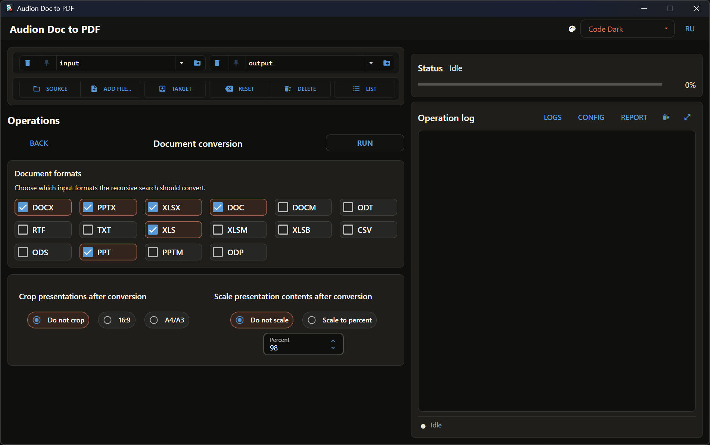

# Audion Doc to PDF

<!-- audion:release -->
<p align="center">
  <a href="https://audion.dev/downloads/doc-to-pdf"></a>
  <a href="https://github.com/Tensionix/doc-to-pdf/releases/latest"></a>
  <a href="https://github.com/Tensionix/doc-to-pdf/releases"></a>
  <a href="https://github.com/Tensionix/doc-to-pdf/blob/main/LICENSE"></a>
</p>

**Version 1.6.2** · 2026-09-01 · 3.6 MB

- [Direct download](https://dl.audion.dev/doc-to-pdf/1.6.2/Audion_Doc_to_PDF_v1.6.2.zip) — unmetered, no rate limits
- [Project page](https://audion.dev/downloads/doc-to-pdf) — every version and how to install

<p align="center"></p>

`SHA-256: 9fa236f861d59490b1f836ae763814dd8e1b6099a75ce62e6ec4cc4a975f2db3`

---

An **Audion** tool, published by [Tensionix](https://github.com/Tensionix).
<!-- /audion:release -->

Portable Windows tool for batch conversion of Word, Excel, and PowerPoint documents through native Microsoft Office export, plus common processing of ready PDFs.

## Features

- recursive folder conversion with mirrored output structure;
- direct conversion of one Office file;
- `16:9` or A-series post-crop for presentation exports;
- presentation content scaling;
- PDF splitting, aspect/margin cropping, numbering, and content scaling;
- metadata under `report\latest\metadata` and run archives;
- shared Source/Target routes across GUI and CLI.

- Word: `.doc`, `.docx`, `.docm`, `.rtf`, `.txt`, `.odt`
- Excel: `.xls`, `.xlsx`, `.xlsm`, `.xlsb`, `.csv`, `.ods`
- PowerPoint: `.ppt`, `.pptx`, `.pptm`, `.odp`

## GUI

Run `launcher_gui.cmd`. The canonical Workbench I/O at the upper left defines direct routes:

- `Source` is a folder or one Office/PDF file;
- `Target` is the result folder;
- source data is not copied into staging or a cache;
- `input` and `output` remain safe initial values and CLI defaults.

Path history is local and excluded from Git. Pinning, locking, file/folder selection, list view, reset, and guarded deletion match the other Audion Workbench projects.

See `docs\GUI.md` for the full GUI guide.

## CLI

Convert default `input` to `output`:

```bat
python system_core\main.py batch --recursive --extensions docx,pptx,xlsx
```

Convert custom folders:

```bat
python system_core\main.py batch --recursive --input-dir "D:\DOCS" --output-dir "E:\PDF" --extensions docx,pptx,xlsx
```

Convert one file:

```bat
python system_core\main.py file --input "D:\DOCS\report.docx" --output-dir "E:\PDF"
```

Process one PDF or a folder of PDFs through explicit routes:

```bat
python system_core\main.py pdf-crop-aspect --mode "16:9" --input-dir "D:\PDF\source.pdf" --output-dir "E:\PDF"
python system_core\main.py pdf-scale-content --percent 98 --input-dir "D:\PDF" --output-dir "E:\PDF"
```

Omitting `--input-dir/--output-dir` preserves the legacy `input -> output` behavior.

## Working data

- `input`, `output`: default routes;
- `report`: metadata and run archives;
- `logs`: CLI and GUI logs;
- `config`: manifest, themes, and settings.

`cleanup_project.cmd` removes only the generated/runtime content declared by that script. Distribution checks include `install\Check-CmdEncoding.cmd` and smoke/doctor commands.

## Requirements

- Windows;
- installed Microsoft Office desktop applications;
- the project portable runtime or compatible Python;
- `pypdf`, `nicegui`, `pyyaml`, `rich`, `pywebview`.

Primary files: `launcher_gui.cmd`, `system_core\main.py`, `system_core\office_export.ps1`, `system_core\ui_nicegui\app.py`, `system_core\ui_nicegui\workbench.py`, `config\tool_manifest.yaml`.
